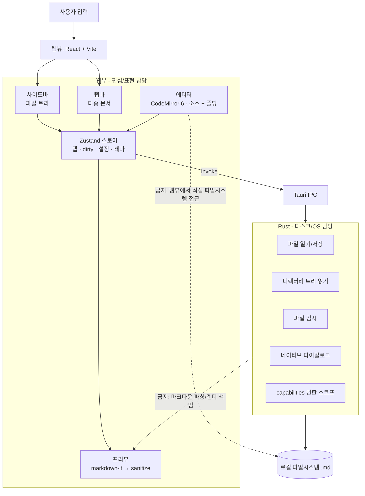

# norii 초기 아키텍처

norii는 로컬 `.md` 파일을 유일한 진실(source of truth)로 두는 단독 데스크탑 마크다운 에디터다. 서버·클라우드·독점 포맷·실시간 협업을 두지 않는다(→ [비목표와 경계 규칙](../rules/non-goals.md)).

핵심 설계 의도는 **책임을 두 층으로 명확히 가르는 것**이다. Rust는 디스크와 OS를 다루고, 웹뷰(React)는 편집 상태·렌더링을 다룬다. 이 경계가 흐려지면 "가볍고 빠르다"는 목표가 무너진다.

## 책임 경계



금지 화살표는 상호작용 전체를 막는 뜻이 아니라, **책임을 넘는 직접 의존**을 막는다는 뜻이다. 웹뷰는 파일시스템을 `invoke`로만 만지고, Rust는 프리뷰 파싱을 떠안지 않는다.

## 두 층의 책임

```text
웹뷰 (React + Vite)
  - 편집 상태 (CodeMirror 6 EditorState)
  - UI: 사이드바 · 탭 · 레이아웃 · 테마
  - 프리뷰 파싱/렌더 (markdown-it + DOMPurify)
  - 폴딩(헤딩/리스트 접기) — 표현 계층
  - dirty 추적 · 세션 상태 (Zustand)

Rust (Tauri core)
  - 파일 열기/저장 · 인코딩 · 개행 처리
  - 디렉터리 트리 읽기 (사이드바용)
  - 파일 감시(watch) · 외부 변경 이벤트 emit
  - 네이티브 다이얼로그 (열기/저장)
  - capabilities 권한 스코프
```

## 핵심 데이터 흐름

문서 본문은 **저장/열기 시점에만** IPC를 건넌다. 키 입력마다 Rust를 호출하지 않는다. 이 규칙이 반응성을 지킨다.

```text
열기:   파일 선택 → invoke(open_file) → Rust가 읽어 반환 → 새 탭 생성, CM6 로드
편집:   CM6 docChanged → Zustand dirty=true            (Rust 호출 없음)
프리뷰: 문서 변경 → 디바운스 → markdown-it → DOMPurify → 프리뷰 DOM   (IPC 없음)
저장:   Cmd+S → invoke(save_file, 본문) → Rust가 디스크에 씀 → dirty=false
```

- 웹뷰(프론트) 내부 구조는 FSD를 따른다 — 레이어·슬라이스·참조 규칙은 [프론트엔드 아키텍처](frontend-architecture.md). Tauri IPC는 `shared/ipc`에 모은다.
- IPC·커맨드 계약의 단일 출처는 [Rust 커맨드 계약](rust-commands.md).
- 편집·폴딩 세부는 [에디터 전략](editor-strategy.md), 프리뷰 파이프라인은 [프리뷰 전략](preview-strategy.md).
- 저장·감시·인코딩 정책은 [파일 생명주기 정책](file-lifecycle.md).

## 프리뷰 파서를 웹뷰에 두는 이유

프리뷰 파싱/렌더는 Rust가 아니라 **웹뷰(JS)** 가 담당한다. 라이브 프리뷰는 문서 변경마다 갱신되는데, 파서를 Rust에 두면 매 갱신이 IPC 왕복이 되어 반응성이 떨어진다. Rust의 원시 파싱 속도 이점보다 왕복 지연이 더 크다. 따라서 Rust는 파일 I/O만 맡고, 파싱은 웹뷰에서 끝낸다.

## 개발 순서

구체적 순서는 [실제 구현 계획](implementation-plan.md)을 단일 출처로 둔다. 먼저 모노레포·mise 스캐폴드와 Tauri 최소 실행을 세우고, Rust 파일 커맨드 → 다중 탭 → 분할 프리뷰 → 사이드바/접기 순으로 넓힌다.
