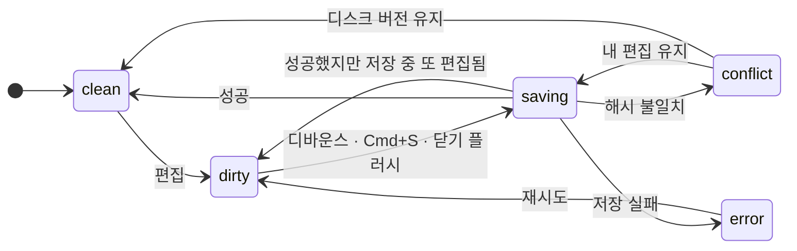
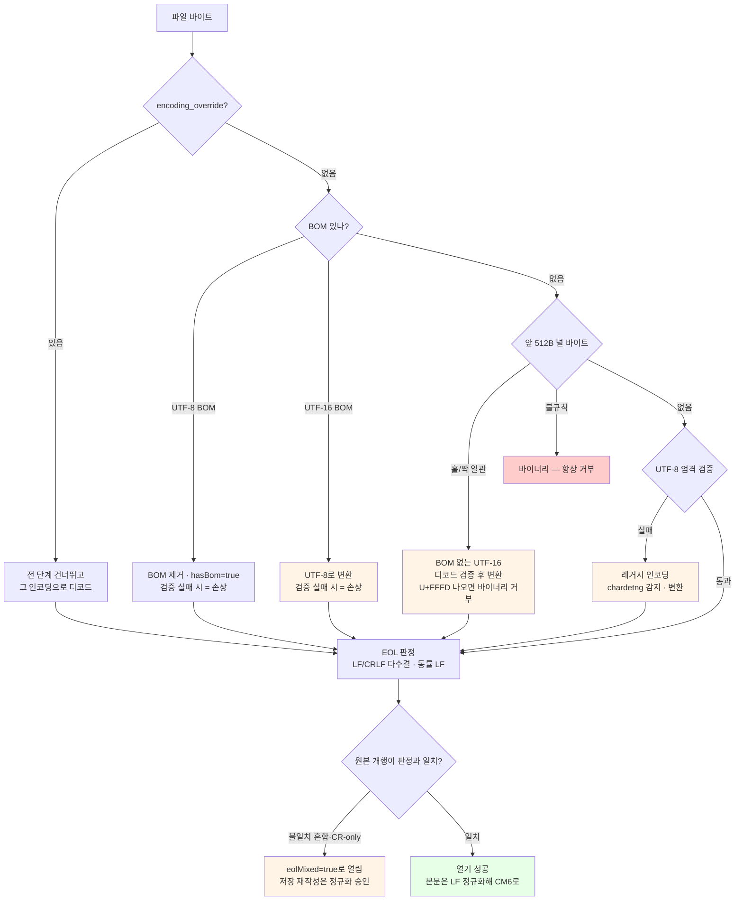

# 파일 생명주기 정책

로컬 `.md` 파일을 다루는 규칙의 단일 출처다. 데이터 유실 방지가 최우선이다.

norii는 파일을 유일한 진실로 두므로, 저장·감시·인코딩·외부 변경 처리가 앱 신뢰도를 직접 좌우한다.

## 정책 표

| 항목 | 정책 |
|---|---|
| Dirty 추적 | CM6 `docChanged`로 감지. 자동 저장 전 "저장 대기"를 탭에 ● 표시(→ [문서 모델](document-model.md)). |
| 자동 저장 | **기본 on** — 타이핑 멈춤 후 디바운스 자동 저장. `Cmd+S`는 즉시 저장(→ [자동 저장](#자동-저장)). |
| 종료 방어 | 종료 시 저장 대기 탭은 플러시(정규화 미승인 탭 제외). Untitled·미승인·저장 실패는 다이얼로그(→ [종료 방어](#종료-방어)). **데이터 유실 방지 최우선.** |
| 저장 방식 | 원자적 쓰기(canonicalize + 임시 파일 + rename) + 내용 해시 충돌 검사(→ [저장 원자성과 충돌 검사](#저장-원자성과-충돌-검사)). |
| 외부 변경 감지 | Rust 파일 watch로 외부 수정 시 리로드/충돌 안내. 자기 저장 에코는 내용 해시로 무시(→ [외부 변경 처리](#외부-변경-처리)). |
| 인코딩 | 메모리·저장은 항상 UTF-8. 비UTF-8은 감지 후 변환해 열기. BOM은 원본 유무 유지(→ [인코딩 정책](#인코딩-정책)). |
| 개행 | 기존 EOL 유지 — 혼합 파일은 다수결(동률 LF), 새 문서는 LF(→ [EOL 정책](#eol-정책)). Windows 대응 시 중요(→ [플랫폼 전략](platform-strategy.md)). |

## 자동 저장

Obsidian처럼 저장을 자동화하되, **자동 병합은 채택하지 않는다** — 그 둘은 별개다.

- **기본 on.** 타이핑이 멈추고 디바운스(기본 2초) 후 자동 저장한다. "편집본과 디스크가 다른" 위험 구간이 항상 수 초 이하로 짧아져, 외부 변경과 겹칠 확률 자체가 급감한다.
- **끄기 옵션은 설정 화면에서 제공한다**(→ [실제 구현 계획](implementation-plan.md)). off면 저장은 `Cmd+S` 수동이고, [종료 방어](#종료-방어)는 플러시 대신 dirty 탭 전체에 저장 확인 다이얼로그를 띄운다.
- `Cmd+S`는 디바운스를 기다리지 않는 **즉시 저장**이다(→ [에디터 전략 — 단축키 계약](editor-strategy.md#단축키-계약)).
- **Untitled 탭(`filePath=null`)은 자동 저장 대상이 아니다** — 저장할 경로가 없다. 첫 저장은 수동(`Cmd+S` → 다이얼로그)이며, [종료 방어](#종료-방어)에서 다이얼로그가 뜨는 유일한 평상 케이스다.
- **정규화 승인 — 저장이 원본 바이트를 재작성하는 탭은 자동 저장이 꺼진 채 열린다.** 현재 두 경우다: ① 비UTF-8로 감지된 파일(`sourceEncoding ≠ 'utf-8'`, UTF-16 포함) — 저장 시 UTF-8로 변환됨, ② 개행이 재작성되는 파일(혼합 EOL·CR-only, `eolMixed`) — 저장 시 판정 EOL로 통일됨. 이런 탭은 배너가 "저장 시 무엇이 바뀌는지"를 알리고, **사용자가 배너에서 승인하거나 첫 수동 저장(`Cmd+S`)을 하면 정규화가 승인된다** — 전역 자동 저장 설정이 on인 경우 그때부터 이 탭도 자동 저장 대상이 된다(승인은 탭 상태이고, 자동 저장 활성은 전역 설정이다 — 승인이 꺼둔 설정을 뒤집지 않는다). 승인 전까지 자동 저장은 그 파일을 건드리지 않는다 — [인코딩 정책](#인코딩-정책)의 "저장 전까지 원본 불변" 안전망을 자동 저장에서도 지키는 규칙이다. 승인 후 첫 저장이 성공하면 탭 메타를 갱신한다(`sourceEncoding='utf-8'`·`eolMixed=false`, 배너 해제) — 변환은 1회로 끝난다. **일반 원칙**: 사용자가 입력하지 않은 바이트 변경을 저장이 수행하게 되는 기능이 향후 추가되면(예: 후행 공백 제거) 그것도 이 승인 대상에 편입한다.
- **충돌 시 일시 중지**: 자동 저장이 `AppError::Conflict`를 받으면 해당 탭의 자동 저장을 일시 중지하고 충돌 다이얼로그를 띄운다. 사용자가 해소(디스크/편집 선택)하면 재개한다 — 디바운스마다 다이얼로그가 반복되는 것을 막는다.
- **자동 병합은 하지 않는다.** Obsidian의 자동 병합(diff-match-patch)은 틀렸을 때 사용자 모르게 내용이 변형된 사례(노트 자가 삭제·내용 뒤섞임)가 보고돼 있다. 충돌은 항상 사용자가 명시적으로 선택한다(→ [외부 변경 처리](#외부-변경-처리)).
- **실수 삭제 방어**: 자동 저장에서는 "저장 안 하면 그만"이라는 방어선이 사라진다. 세션 내 undo가 1차 방어이고, 주기 스냅샷(Obsidian File Recovery류) 도입은 열린 결정(→ [실제 구현 계획](implementation-plan.md)).

## 저장 흐름 (전체 경로)

편집이 디스크에 닿기까지 프론트 3계층과 Rust를 가로지른다. 각 단계의 정책은 이 문서의 해당 절이 단일 출처이고, 이 그림은 그 절들이 **어느 순서로 맞물리는지**를 고정한다.

```mermaid
sequenceDiagram
    autonumber
    participant E as 에디터(CM6)
    participant S as 자동 저장 스케줄러
    participant Q as 저장 큐(탭별 직렬화)
    participant R as Rust save_file
    participant D as 디스크

    E->>S: docChanged (dirty=true)
    Note over S: 타이핑이 이어지면 타이머 리셋<br/>(마지막 변경 기준 2초 디바운스)
    S->>Q: 디바운스 만료 → 플러시 요청
    Note over Q: 같은 탭의 이전 저장이 끝난 뒤 실행<br/>(앞 저장의 새 해시를 본 뒤 나가야 가짜 충돌이 없다)
    Q->>R: saveFile(text, eol, hasBom, expectedHash)
    Note over R: 전역 저장 잠금 획득
    R->>D: 디스크 내용 해시 읽기
    alt 해시 ≠ expectedHash (외부 변경)
        R-->>Q: AppError::Conflict
        Q-->>S: 자동 저장 일시 중지
        Note over E: 충돌 배너 — 사용자가<br/>디스크/편집 버전을 선택 (자동 병합 금지)
    else 해시 일치
        R->>D: 임시 파일 쓰기 + fsync + rename (원자적)
        R-->>Q: SaveResult(hash, mtime)
        Note over Q: lastSavedHash 갱신.<br/>저장 중 추가 편집이 있었으면 dirty 유지
    end
```



**종료·탭 닫기의 재확인 루프**: 저장 왕복(IPC) 중에도 타이핑은 계속될 수 있다. 그래서 닫기·종료는 `saved` 응답만 믿지 않고 **최신 dirty 상태를 다시 분류해 깨끗해질 때까지 재저장**한다(→ [종료 방어](#종료-방어)). 이 재확인이 없으면 저장이 나가는 수 초 동안의 편집이 조용히 사라진다.

## 탭 상태 전이



- `saving → dirty`(저장 중 추가 편집)가 **데이터 유실이 새던 자리**다 — 닫기·종료는 저장 성공 응답만 믿지 않고 dirty가 사라질 때까지 재저장한다(→ [종료 방어](#종료-방어)).
- `conflict` 상태에서는 **자동 저장이 멈춘다.** 사용자가 디스크/편집 버전을 고를 때까지 유지된다(자동 병합 금지 → [자동 저장](#자동-저장)).

## 저장 원자성과 충돌 검사

데이터 유실 방지의 핵심 두 규칙이다. 커맨드 시그니처는 [Rust 커맨드 계약](rust-commands.md)을 단일 출처로 둔다.

- **원자적 쓰기**: `save_file`은 대상 파일을 직접 덮어쓰지 않는다. 먼저 경로를 canonicalize해 심볼릭 링크의 **실제 대상**을 찾고(링크 자체를 일반 파일로 갈아치우지 않도록), 그 디렉터리에 임시 파일을 쓰고 원본 권한을 복사한 뒤 rename으로 교체한다. 저장 중 크래시·전원 차단이 나도 디스크에는 항상 "온전한 옛 파일" 아니면 "온전한 새 파일"만 존재한다. **알려진 한계**: rename 교체는 하드 링크를 보존하지 않는다(같은 파일의 다른 링크 이름은 옛 내용으로 남는다) — 크래시 안전성을 위해 의도적으로 감수하는 트레이드오프다. 프로세스 안의 동시 저장은 전역 저장 잠금으로 직렬화하며, 외부 프로세스와의 경쟁(검사와 교체 사이의 틈)은 잠금 밖의 잔여 위험으로 저장 직전 해시 검사가 그 창을 최소화한다.
- **읽기 전용 거부**: 대상 파일에 쓰기 권한이 없으면(읽기 전용, chmod 400 등) 쓰지 않고 `AppError::Permission`으로 거부한다. 원자적 쓰기의 rename은 디렉터리 권한만 검사해 파일 잠금을 우회할 수 있으므로(E2E 실측), 저장 전에 명시적으로 검사한다 — 사용자가 일부러 잠가 둔 파일을 자동 저장이 조용히 고치지 않게 하는 규칙이다(VS Code와 동일 방향. 명시적 덮어쓰기 UI는 필요해지면 추후 도입).
- **저장 시 충돌 검사**: 저장 전에 디스크 내용 해시를 탭이 마지막으로 알던 값(`expected_hash` = `lastSavedHash`)과 비교한다. 다르면 쓰지 않고 `AppError::Conflict`를 반환하고, 프론트는 [외부 변경 처리](#외부-변경-처리)의 충돌 흐름으로 안내한다. mtime은 초 단위 세분성인 파일시스템에서 오판할 수 있어 기준으로 쓰지 않는다. watch 이벤트가 유실·지연돼도 이 검사가 마지막 방어선이 된다.

## 종료 방어

창을 닫거나 앱을 종료할 때:

- 저장 대기 중인 탭 가운데 **경로가 있고 정규화 승인이 필요 없거나 이미 승인된 탭**은 플러시(즉시 저장)하고 종료한다 — 자동 저장 세계에서는 이것이 기본 동작이고, 다이얼로그로 사용자를 막지 않는다.
- **Untitled 탭·정규화 미승인 dirty 탭이 있거나 플러시가 실패하면** 저장 확인 다이얼로그를 띄운다. 미승인 탭을 플러시에 포함하면 종료가 [정규화 승인](#자동-저장)을 우회해 무단 변환하게 되므로, 반드시 다이얼로그 대상이다.
- **확인 다이얼로그는 인앱 모달(`<dialog>`)이다** — JS `alert/confirm`은 웹뷰 이벤트 루프를 블로킹해 E2E(WebDriver)가 멈추고, 네이티브 비동기 다이얼로그(plugin-dialog `ask`)는 자동 검증이 불가능하다. 데이터 유실 방지의 마지막 관문은 자동 검증 가능해야 하므로 인앱 모달을 쓴다(파일 열기/저장 선택 창은 계속 네이티브다).

이 방어가 없으면 데이터 유실로 직결된다.

## 외부 변경 처리

Rust watch가 `file-changed`/`file-removed` 이벤트를 보낸다(→ [Rust 커맨드 계약](rust-commands.md#이벤트-계약-rust--웹뷰)). 프론트 처리:

```text
file-changed (hash = 탭의 lastSavedHash):  자기 저장 에코 또는 동일 내용 — 무시
file-changed (해당 탭이 dirty 아님):        조용히 리로드
file-changed (해당 탭이 dirty):             충돌 안내 — 디스크 버전 vs 편집 버전 선택
file-removed:                               탭에 표시, 저장 시 새로 생성 선택
```

**자기 저장 에코 억제**: 내가 저장해도 watch는 `file-changed`를 쏜다. Rust는 이벤트를 처리하는 시점에 디스크 내용의 해시를 계산해 이벤트에 담고, 프론트는 열기/저장이 반환한 해시를 탭에 기억해(`lastSavedHash`, → [문서 모델](document-model.md)) 같으면 무시한다. 해시가 "그 순간의 실제 디스크 내용"에서 나오므로, 이벤트가 늦게 도착하거나(연속 저장) mtime 세분성이 거친 파일시스템에서도 오판하지 않는다. 이 규칙이 없으면 저장할 때마다 "외부 변경" 처리가 오작동한다 — 자동 저장에서는 저장이 빈번하므로 특히 중요하다.

**비활성 탭의 충돌 표시**: 충돌 배너는 활성 탭에 뜬다. 비활성 탭에서 충돌이 나면 그 탭에 **경고 배지(⚠)**를 표시하고, 사용자가 그 탭으로 전환하면 충돌 배너가 뜬다 — dirty ●만으로는 충돌을 알아차릴 수 없기 때문이다. 배지는 시각 신호만 더하고 작업 흐름을 끊지 않는다(자동 탭 전환은 하지 않는다). 비활성 탭의 **파일 삭제(file-removed) 표시도 같은 배지(⚠)를 쓰되 라벨은 삭제 전용**이다 — 탭을 열었을 때의 안내(충돌 선택 vs 재생성 저장)가 다르므로 배지 라벨에서부터 구별한다.

**저장 중 이벤트 지연**: 저장이 진행 중인 경로의 `file-changed`는 그 저장이 끝난 뒤에 처리한다. 이벤트가 저장 응답(새 해시)보다 먼저 도착하면 `lastSavedHash`가 아직 이전 값이라 자기 저장을 충돌로 오판하기 때문이다. VS Code도 같은 전략이다 — 저장 진행 중에는 파일 변경으로 인한 리로드를 막는다(`saveSequentializer` 가드). `file-removed`도 같은 지연을 거치고, 처리 시점에 **디스크를 재확인해 정말 없을 때만** 삭제로 처리한다 — 유예(100ms)를 거친 삭제 신호가 재생성 저장 뒤에 도착하는 순서 역전에서, 멀쩡한 파일에 삭제 표시와 자동 저장 정지가 남는 것을 막는다. 존재를 단정할 수 없는 실패(권한 등)에도 표시하지 않는다 — 삭제 표시는 확실할 때만 켠다. "자동 저장은 삭제된 파일을 되살리지 않는다"는 **저장 실행 시점**에 판정한다 — 재확인 대기 중 발화해 그 뒤에 줄을 선 자동 저장도 탭이 삭제 표시면 건너뛴다. 재생성(새로 생성 저장)은 명시적 저장(`Cmd+S`·배너 버튼·닫기/종료 플러시)만 한다.

자동 저장 덕에 dirty 창이 수 초 이하라, 충돌 안내가 뜨는 것은 "타이핑 중 그 몇 초 안에 외부 도구가 같은 파일을 고친" 드문 경우뿐이다.

Obsidian도 외부 변경 처리에서 골치를 앓는 영역이므로, 충돌 정책을 초기에 단순하고 명확하게 정한다.

## 인코딩 정책

메모리와 저장은 **항상 UTF-8**이다. 그 위에서 레거시 파일을 다음 규칙으로 다룬다.

열기 파이프라인의 분기는 결정론적이라 그대로 테스트 케이스가 된다. 아래 그림은 순서를 고정하고, 각 단계의 규칙은 이어지는 목록이 단일 출처다. 변환 대상(UTF-16·레거시 인코딩)과 재작성 대상(혼합 EOL)은 모두 열리며, 저장의 재작성은 배너 + [정규화 승인](#자동-저장)을 거친다.




- **열기 파이프라인(순서 고정 — 각 단계가 결정론적 규칙이라 그대로 테스트 케이스가 된다)**:
  1. **BOM 스니핑** — UTF-8(`EF BB BF`)/UTF-16 LE(`FF FE`)/UTF-16 BE(`FE FF`) BOM이 있으면 그 인코딩으로 확정한다(UTF-16도 UTF-8로 변환해 연다).
  2. **널 바이트 검사(바이너리 판정, VS Code와 동일 규칙)** — 앞 512바이트를 스캔한다. 널 바이트가 없으면 다음 단계로. 널 바이트가 **홀수 인덱스에만 일관되게** 있으면 UTF-16 LE, **짝수 인덱스에만 일관되게** 있으면 UTF-16 BE로 판정한다(BOM 없는 UTF-16). 그 외 불규칙한 널 바이트는 **바이너리** — `AppError::Encoding`으로 열기를 거부하고 명확히 안내한다. 파일은 건드리지 않는다. **디코드 검증**: 홀짝 일관성 판정은 관대해(널 1개도 UTF-16 분류) 바이너리를 깨진 텍스트로 열 수 있다 — 판정된 UTF-16으로 전체를 디코드해 보고, 결과에 대체 문자(U+FFFD)가 하나라도 나오면 텍스트가 아니라 **바이너리로 거부**한다. 통과한 경우에만 변환해 연다.
  3. **UTF-8 엄격 검증** — 통과하면 UTF-8 확정. 대다수 파일이 여기서 끝나고, 감지기가 UTF-8을 오판할 여지를 차단한다.
  4. **chardetng 감지 → encoding_rs 변환** — 나머지(EUC-KR/CP949 레거시 한글, Shift-JIS 등)는 chardetng로 감지하고 encoding_rs로 **UTF-8로 변환해 연다**. 탭에 배너로 안내한다 — "EUC-KR로 감지됨. 저장하면 UTF-8로 저장됩니다." 글자 내용은 보존되고 저장 인코딩만 바뀐다. chardetng는 항상 추측을 반환하므로 이 단계는 실패하지 않는다 — 거부는 2단계에서만 일어나고, 오판은 아래 안전망으로 다룬다.
- **오판 안전망**: 판별이 틀려도 **저장하기 전까지 파일은 바뀌지 않는다.** 배너가 감지된 인코딩을 보여주므로, 이상하게 보이면 닫기만 하면 원본이 그대로다. 자동 저장도 이 안전망을 깨지 않는다 — 비UTF-8 탭은 **정규화 승인** 전까지 자동 저장이 꺼져 있다(→ [자동 저장](#자동-저장)).
- **수동 재해석**: `open_file`은 `encoding_override` 인자를 받는다 — 지정하면 파이프라인 **전 단계(BOM 스니핑 포함)를 건너뛰고** 전체 바이트를 그 인코딩으로 디코드한다(다른 인코딩의 BOM은 내용으로 노출 — 있는 그대로 보여준다). 인코딩 이름은 WHATWG 라벨("euc-kr"·"utf-16le" 등, encoding_rs 표준)을 쓴다(→ [Rust 커맨드 계약](rust-commands.md)). VS Code의 "Reopen with Encoding"에 해당하는 구제 수단이다. **UI 노출**: 인코딩 배너에 "다른 인코딩으로 다시 열기" 선택을 넣는다 — 주요 라벨(utf-8·euc-kr·shift_jis·utf-16le·utf-16be 등)을 고르면 그 인코딩으로 다시 연다. 감지가 틀린 파일을 norii 안에서 바로 구제하는 수단이다.
- **BOM**: 열 때 제거해 본문에 노출하지 않고 `hasBom`으로 기억한다(→ [문서 모델](document-model.md)). 저장 시 원본에 있던 그대로 유지한다 — BOM 유무가 저장만으로 바뀌지 않는다.

## EOL 정책

- **기존 파일**: LF/CRLF가 섞여 있으면 **다수결**로 판정하고(동률이면 LF), 저장 시 그 EOL로 통일한다. 집계는 LF/CRLF만 대상으로 하며 CR 단독(옛 mac 개행)은 무시한다 — CR-only 파일은 LF로 판정한다. 원본 개행이 판정 결과와 완전히 일치하지 않는 파일(혼합·CR-only)은 `eolMixed`로 표시되며, 통일 재작성은 [자동 저장](#자동-저장)의 **정규화 승인**을 거친다.
- **새 문서**: 모든 플랫폼에서 **LF** — git·마크다운 생태계 표준이고, 여러 OS가 같은 폴더를 동기화(iCloud/Dropbox)해도 파일마다 개행이 갈리지 않는다.
- CM6 내부 문서는 LF로 정규화하고, 저장 시 탭의 `eol`로 되돌린다.

## 앱 상태는 `.md`에 넣지 않는다

세션 복원·접힘 상태 같은 UI 상태는 `.md` 본문이 아니라 앱 config/사이드카에 저장한다. `.md`에 메타데이터를 섞으면 파일이 지저분해지고 다른 에디터 호환이 깨진다. 이 경계는 [비목표](../rules/non-goals.md#접힘-상태-영속화의-경계)를 단일 출처로 둔다.
