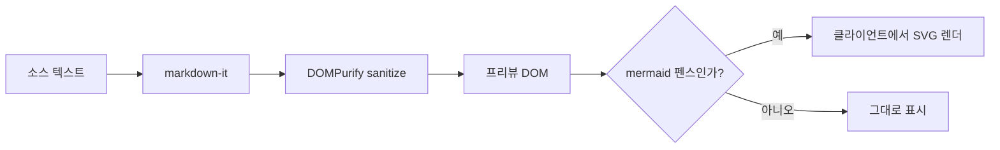
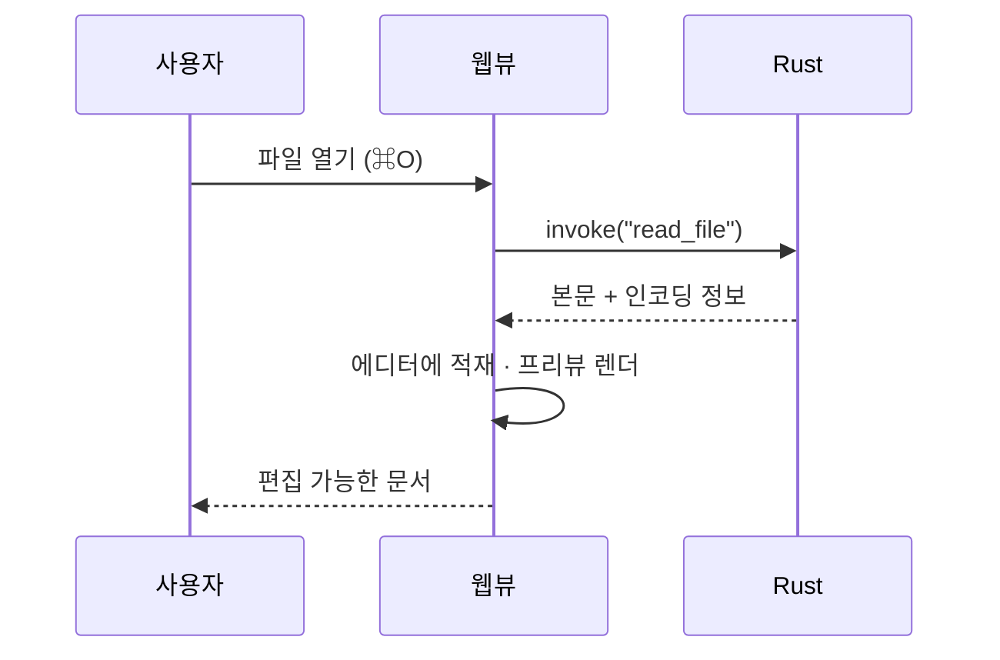
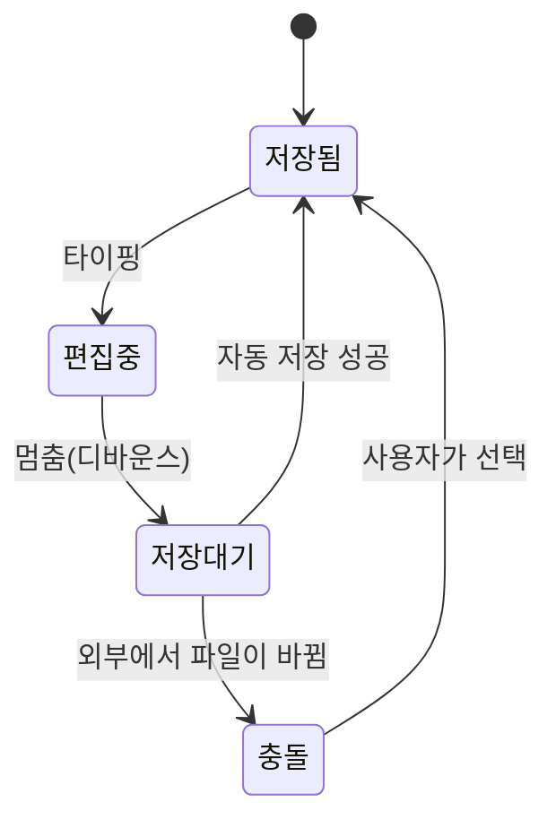

# 다이어그램 예시 (Mermaid)

` ```mermaid ` 펜스 안에 다이어그램을 쓰면 프리뷰에 그려진다. 소스는 그대로 텍스트로 남으므로 다른 에디터에서도 코드 블록으로 열린다.

## 플로차트



## 시퀀스 다이어그램



## 상태 다이어그램



## 넓은 다이어그램 (가로 스크롤 확인용)


## 같은 다이어그램을 두 번

내용이 같으면 다시 그리지 않고 캐시에서 재사용한다.


## 문법이 틀린 다이어그램

앱이 깨지지 않고, 그 자리에만 오류를 알린다. 뒤에 오는 다이어그램은 정상적으로 그려진다.

```mermaid
이건 다이어그램이 아니다 {{{
```


## mermaid가 아닌 코드 블록

이건 그냥 코드 블록으로 남는다.

```ts
const md = new MarkdownIt({ html: true, linkify: true });
```
